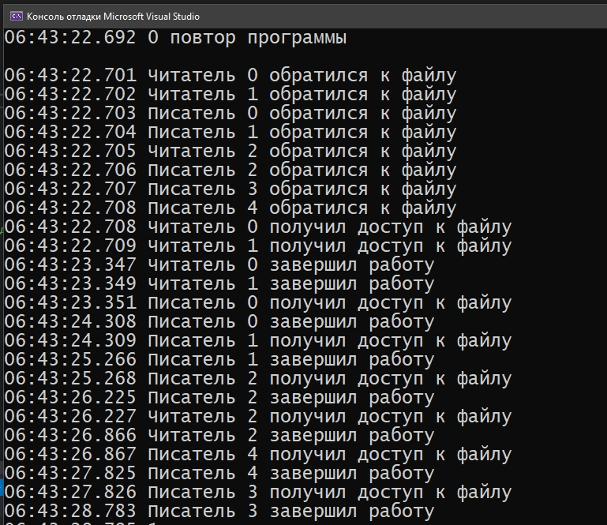
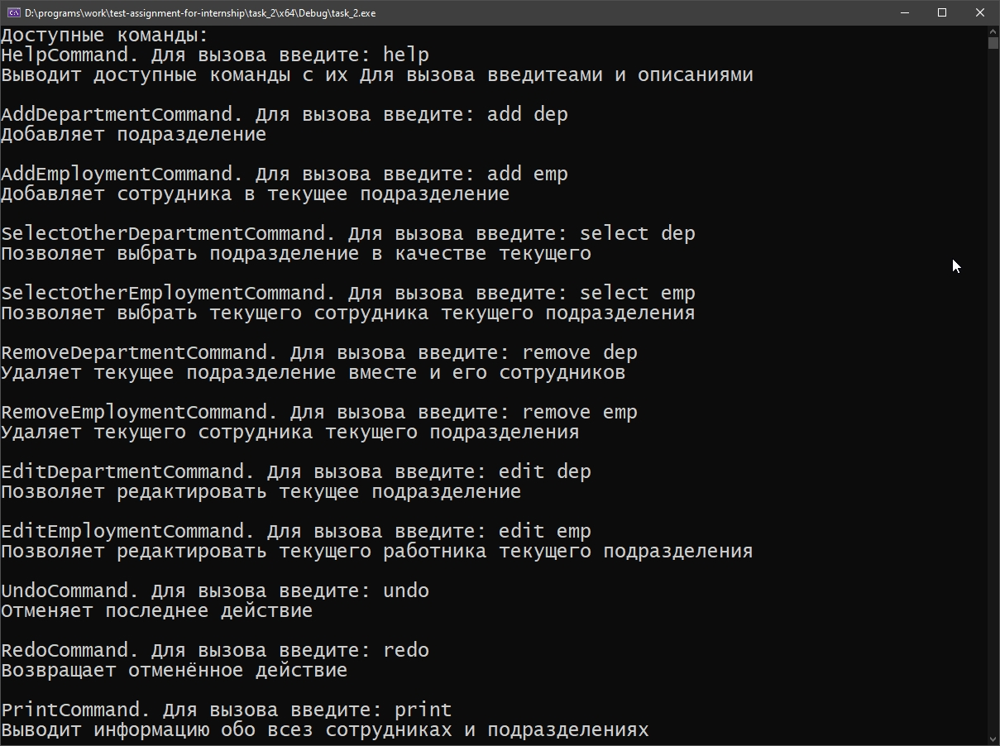
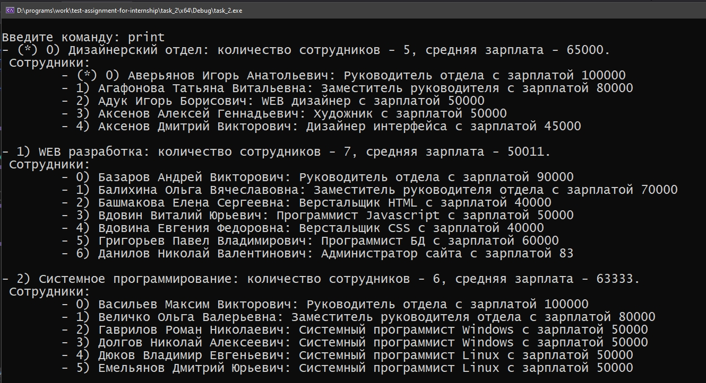
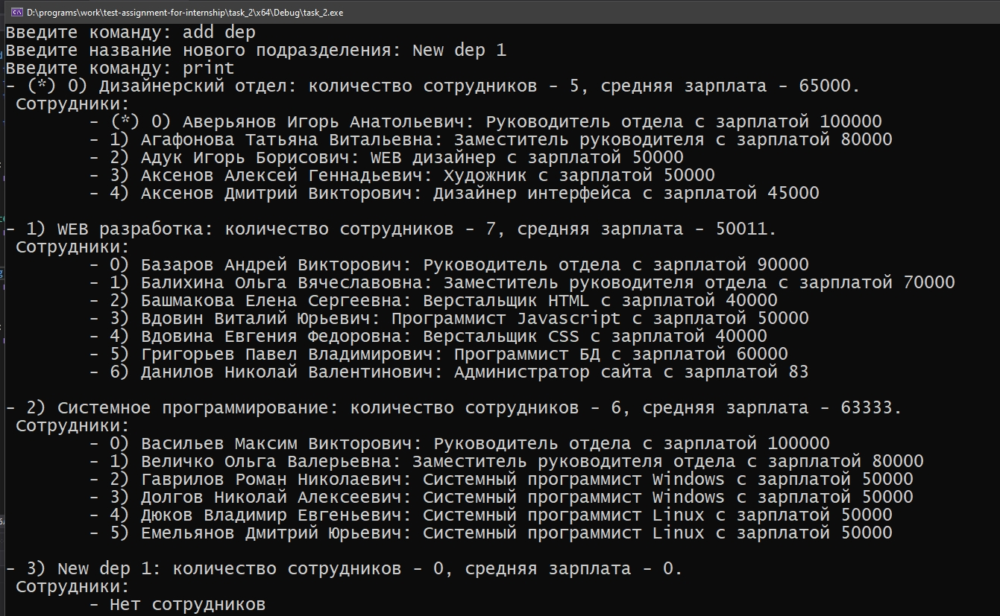
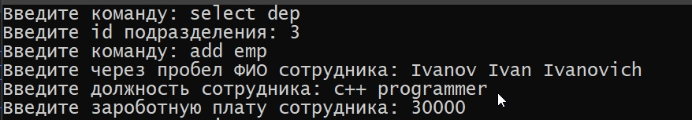
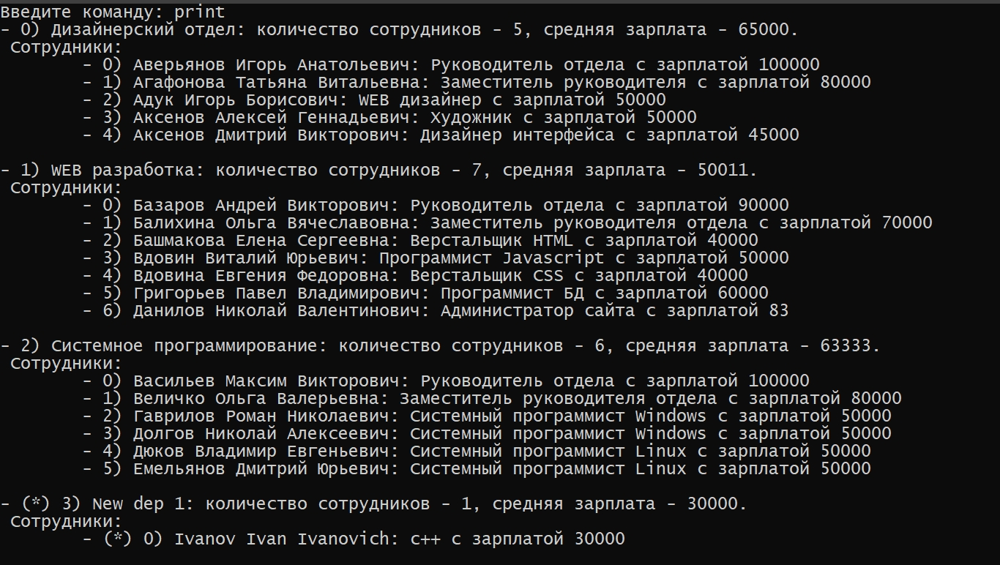

# Описание репозитория
Данный репозиторий - выполненное тестовое задание для стажировки в одной из компаний. 
# Постановка задачи
1) Необходимо реализовать схему взаимодействия процессов [«читатели-писатели»](https://ru.wikipedia.org/wiki/%D0%97%D0%B0%D0%B4%D0%B0%D1%87%D0%B0_%D0%BE_%D1%87%D0%B8%D1%82%D0%B0%D1%82%D0%B5%D0%BB%D1%8F%D1%85-%D0%BF%D0%B8%D1%81%D0%B0%D1%82%D0%B5%D0%BB%D1%8F%D1%85) под ОС Windows с использованием соответствующих системных вызовов WinAPI и многопоточности, используя thread, event, и mutex. 

    Приоритет может быть любым. Потоки должны разделять общее адресное пространство. Количество читателей, писателей, повторов программы, а также временные задержки, задаются директивами препроцессора. Обеспечить вывод на экран результат работы читателей и писателей.
2) Необходимо разработать приложение, отображающее список
подразделений предприятия и его сотрудников в виде дерева. Список должен загружаться из файла формата xml (xml файл с данными приложен). Программа должна обеспечить возможность добавления, удаления, редактирования подразделений и сотрудников в них. Программа должна обеспечить возможность отмены и возврата изменений. При разработке необходимо использовать паттерны проектирования.

    Поля сотрудника:
    - ФИО;
    - должность;
    - зарплата (целое число).

    Поля подразделения:
    - наименование;
    - количество сотрудников;
    - средняя зарплата.

# Решение
- ## Задача 1
  #### Общая информация
  - Выбрана следующая модель поведения: `Как только в очереди появляется хотя бы один писатель, не пускаем новых читателей.`
  #### Пример(ы) работы:    
  
  #### Сборка и запуск
  - Для сборки и запуска рекомендуется использовать visual studio ([sln файл проекта](task_1/task_1.sln))
  - Альтернативно *(не тестировалось)*: 
    ```bash 
    #(находясь в папке task_1)
    g++ -std=c++14 -o task_1.cpp task1
    ./task1  
    ``` 
- ## Задача 2
  #### Общая информация
  - В решении используется библиотека [TinyXML-2](https://github.com/leethomason/tinyxml2) для работы с .xml файлом. *(Файлы TinyXML-2 включены в проект)*
  - Для поддержки отмены/возврата изменений используется паттерн ["команда"](https://ru.wikipedia.org/wiki/%D0%9A%D0%BE%D0%BC%D0%B0%D0%BD%D0%B4%D0%B0_(%D1%88%D0%B0%D0%B1%D0%BB%D0%BE%D0%BD_%D0%BF%D1%80%D0%BE%D0%B5%D0%BA%D1%82%D0%B8%D1%80%D0%BE%D0%B2%D0%B0%D0%BD%D0%B8%D1%8F)).
  - В репозитории есть диаграмма, отражающая структуру программы и текущий прогресс в виде [pdf](task_2/MindMap/task2.pdf), и [исходника в формате xmind](task_2/MindMap/task2.xmind).
  - **На windwos при вводе в консоли следует использовать только латиницу**, по какой-то причине, кириллица считывается некорректно (побочный эффект использования utf-8) - пофиксить не удалось.
  #### Пример(ы) работы:    
      

  #### Сборка и запуск
  - Для сборки и запуска рекомендуется использовать visual studio ([sln файл проекта](task_2/task_2.sln))
  - Альтернативно *(не тестировалось)*: 
    ```bash 
    #(находясь в папке task_2)
    g++ -std=c++14 -o task_2.cpp Application.cpp Database.cpp CommandHistory.cpp Commands.cpp Department.cpp Input_output.cpp Employment.cpp tinyxml2.cpp task2
    ./task2  
    ```  